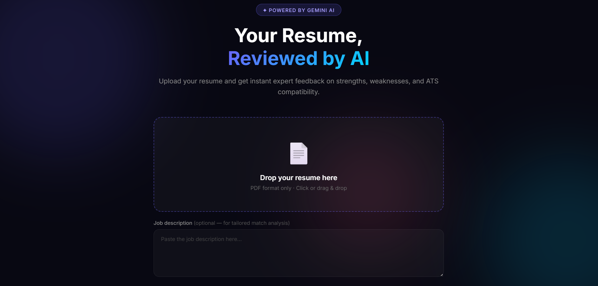
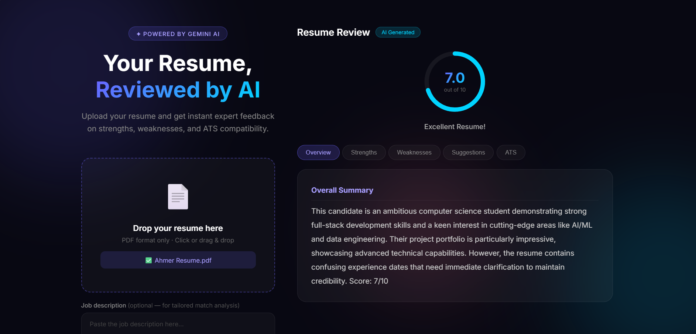

# AI Resume Reviewer

Upload a PDF resume and get a structured AI review — overall score, strengths, weaknesses, ATS feedback, and concrete improvement suggestions.

Built with FastAPI and Google Gemini.

---

## Live Demo

https://ai-resume-reviewer-gold-theta.vercel.app/

---

## Screenshots

| Upload | Review |
|---|---|
|  |  |

---

## Stack

- **Backend** – FastAPI, pdfplumber, Google Gemini API
- **Frontend** – HTML, CSS, Vanilla JavaScript
- **Hosting** – Vercel (Python runtime / Vercel Functions)
- **Other** – marked.js for markdown rendering, dotenv for config

---

## Features

- PDF upload with drag & drop
- AI‑generated resume review using Gemini
- Animated overall score ring (0–10)
- Tabbed breakdown: Overview, Strengths, Weaknesses, Suggestions, ATS, Job Match (when JD provided)
- Optional job description box for tailored matching
- Downloadable text report and copy‑to‑clipboard review
- Responsive layout with subtle loading state, progress bar, and toast notifications

---

## Setup (Local)

1. **Clone the repo**

```bash
git clone https://github.com/ahmeraftab/ai-resume-reviewer.git
cd ai-resume-reviewer
```

2. **Create and activate a virtual environment** (recommended)

```bash
python -m venv venv
venv\Scripts\activate      # Windows
# or
source venv/bin/activate   # macOS / Linux
```

3. **Install dependencies**

```bash
pip install -r requirements.txt
```

4. **Add your Gemini API key**

Create a `.env` file in the project root:

```env
GEMINI_API_KEY=your_key_here
```

5. **Run the app**

Either plain uvicorn:

```bash
uvicorn main:app --reload
```

or the Vercel CLI, which mirrors production most closely:

```bash
npm i -g vercel
vercel dev
```

6. **Open in browser**

```text
http://127.0.0.1:8000
```

---

## Deploying on Vercel

This project is configured to run on [Vercel](https://vercel.com) using the Python runtime — no separate backend host needed.

1. Push the repo to GitHub (already done if you're reading this on GitHub).
2. In the Vercel dashboard, **Add New → Project** and import `ahmeraftab/ai-resume-reviewer`.
3. Vercel auto-detects the FastAPI app from `main.py`. Leave the build settings as default.
4. Add an environment variable: `GEMINI_API_KEY` = your Gemini key (Project Settings → Environment Variables).
5. Deploy. Every push to `main` redeploys automatically.

Or via the CLI:

```bash
npm i -g vercel
vercel login
vercel link
vercel env add GEMINI_API_KEY
vercel --prod
```

---

## Project Structure

```text
ai-resume-reviewer/
├── main.py          # FastAPI backend + Gemini integration
├── index.html       # Single-page frontend
├── vercel.json       # Vercel Functions config (maxDuration, entrypoint)
├── requirements.txt # Python dependencies
├── public/          # Screenshots used in this README
├── .gitignore       # Git ignore rules (.env, venv, etc.)
└── README.md
```

> `.env` exists locally but is not committed to the repository.

---

## Environment Variables

| Name            | Required | Description                 |
|-----------------|----------|-----------------------------|
| `GEMINI_API_KEY`| ✅       | Google Gemini API key       |

Get a free API key from: https://aistudio.google.com

---

## Notes

- Only **PDF** resumes are supported at the moment.
- The deployed app on Vercel uses the same `GEMINI_API_KEY` via Vercel's environment variables (no `.env` committed).
- If Gemini's API is under heavy load, you may occasionally see a 503 error; trying again later usually works.

---
